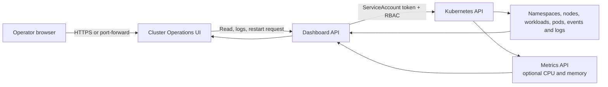

# Kubernetes Operations Dashboard

Current version: **0.1.57**. Includes the operations workspace UI, application topology,
namespace change history, saved logs, capacity insights and clickable worker node details.
See [CHANGELOG.md](CHANGELOG.md) for consolidated release history.

## 0.1.48 — WebLogic and namespace changes

Opt-in WebLogic Domain tracking plus Pod, Service, Ingress, PVC and namespace-policy
configuration history. See [coverage and setup](CHANGELOG.md).

## 0.1.46 — What changed recently?

The Changes tab compares configuration snapshots and records dashboard operations
with user, outcome and before/after values. See [setup and limitations](CHANGELOG.md).

## 0.1.43 — Shared Pod log archive

The Pod Logs button now saves fetched logs to the configured PVC and links to the same
records in History & insights. See [release setup and retention](CHANGELOG.md).

## 0.1.41 startup fix

Accept scientific-notation whole numbers in history configuration and render the
Helm storage cap as a decimal integer. Fixes startup failure in 0.1.40 even with
history disabled. No permissions or collection behavior change.

## New in 0.1.40 (preview)

Optional PVC-backed resource history, retained log snapshots, evidence-based memory
review candidates, CSV export and a refreshed interface. See [History setup and limitations](HISTORY.md).
Existing live views remain available without persistence.

A lightweight, dependency-free dashboard for operating an existing Kubernetes cluster. It uses the Kubernetes API through `kubectl` and the dashboard ServiceAccount; it does not depend on Prometheus, a database, or any cloud-provider API.

It works with conformant Kubernetes clusters. The cluster needs the Metrics API (`metrics-server`) only for live node and pod CPU/memory figures. All other pages work without it.

## Features

- Cluster namespaces and nodes, workload readiness, pod health, events, and live metrics.
- Sortable pods by name, phase, containers, age, CPU, memory, and restart count.
- Per-container logs, previous-container logs, time-range selection, and in-browser log search.
- Download the selected container log view as a timestamped `.log` file.
- Workload application context: selector-matched Pods, HPA configuration, Services, ready EndpointSlice targets, and Ingress routes.
- Application map for each Deployment, StatefulSet, or DaemonSet, with live rollout status and workload-to-Pod-to-Service-to-Ingress relationships.
- Downloadable workload diagnostics bundle containing workload and Pod JSON, `describe` output, workload events, and recent all-container logs.
- Capacity & limits view: per-container CPU/memory requests, limits, live usage, matching workload ready/desired replica state, Pod/main/init/missing-policy filters, totals, and Excel-compatible CSV export for sizing reviews. Namespace LimitRange defaults are identified separately from values set directly on a container.
- Resource Explorer for namespace-level HPA, Services/endpoints, Ingresses, PVCs, Jobs, CronJobs, quotas, and limit ranges.
- Pod, workload, and node diagnostics, plus namespace quota/HPA/CronJob, PVC, Service, Ingress, and EndpointSlice views.
- Confirmation-gated rollout restarts for Deployments, StatefulSets, and DaemonSets; controller-managed pod restart; optional replica scaling for Deployments and StatefulSets.
- Optional confirmation-gated CronJob suspend/resume, CronJob schedule editing, and HPA minimum/maximum replica updates.
- Click any Resource Explorer row to view the corresponding Kubernetes `describe` output, without leaving the dashboard.
- Local application login with `read` and `write` roles, plus Kubernetes RBAC restrictions.

## How it works



The dashboard is deployed inside the target cluster. It reads live Kubernetes state at request time; it does not copy workload data into an external database.

## Why this dashboard is different

| This dashboard | Typical monitoring dashboard |
| --- | --- |
| Uses the Kubernetes API and `kubectl` for live operational state | Commonly relies on a metrics database and dashboards built from historical telemetry |
| Works without Prometheus for core workload, Pod, event, log, and restart operations | Usually needs Prometheus or another monitoring backend before useful data is available |
| Includes safe, confirmation-gated restart actions and per-container log download | Often provides observation only, with operations performed separately in a terminal |
| Has application `read`/`write` roles plus Kubernetes RBAC namespace restrictions | Frequently uses one broadly privileged operator account |
| Has no exec shell, Secret viewer, YAML editor, or arbitrary delete capability | Full Kubernetes consoles can expose a much wider administrative surface |

## Security model

The dashboard is intentionally not an admin console: it has no shell/exec, YAML editor, secret access, or arbitrary deletion capability. Its ServiceAccount gets cluster-wide **read-only** access to node and namespace metadata. Workload reads and optional write actions are granted only to explicitly selected namespaces unless `rbac.clusterWideActions` is enabled. The optional resource edits are deliberately narrow: CronJobs can change only `spec.schedule`, while HPAs can change only `minReplicas` and `maxReplicas`.

For production, put an internal HTTPS Ingress with your SSO/OIDC proxy in front of it. The optional built-in login is suitable for a controlled internal environment, but it is not a substitute for corporate identity management or per-user Kubernetes audit identities.

## Build

```bash
docker build --pull --no-cache --build-arg KUBECTL_VERSION=v1.37.0 -t ghcr.io/<your-org>/kubernetes-operations-dashboard:0.1.30 .
docker push ghcr.io/<your-org>/kubernetes-operations-dashboard:0.1.30
```

The image includes the `kubectl` version declared in the Dockerfile. Build with a client version compatible with the target cluster:

```bash
docker build --pull --no-cache --build-arg KUBECTL_VERSION=v<matching-cluster-version> -t <registry>/kubernetes-operations-dashboard:<tag> .
```

See [`chart/README.md`](chart/README.md) for Helm installation, RBAC, image-pull secrets, authentication, and ingress configuration.

## Local development

Run it only from a trusted machine with a restricted active kubeconfig:

```bash
python3 server.py
```

Then open `http://127.0.0.1:8787`. To use a non-default kubeconfig, set `KUBECONFIG`; do not expose this development server to a network.

## Before publishing

Do not commit private values files, kubeconfigs, registry credentials, passwords, or certificates. Review the RBAC permissions for your organization and select an appropriate open-source license before creating the public repository.
